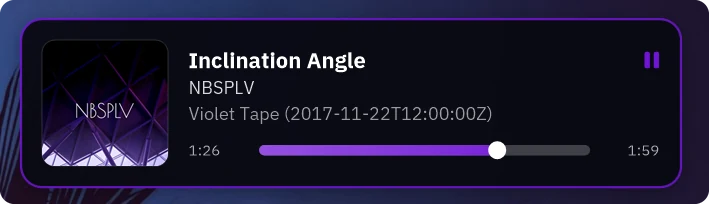
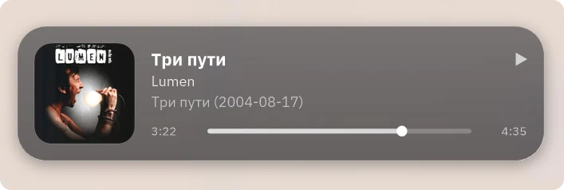
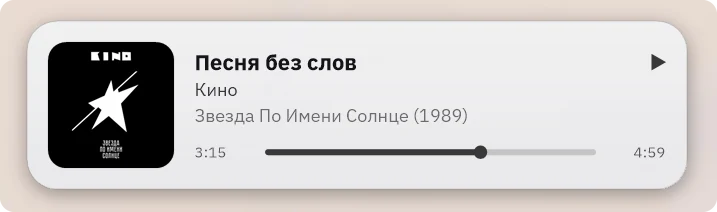
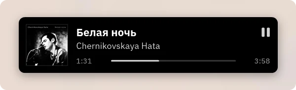

<h1 align="center">foo_osd</h1>

<p align="center">
  A modern on-screen display for <a href="https://www.foobar2000.org/">foobar2000</a> v2.<br />
</p>

<p align="center">
  
</p>

## Features

- **31 presets** and four layouts (Classic, Compact, Banner, Poster), or build your own look. The
  preferences page recognises a preset's look and names it, so you always know where you are.
  **Save** your own looks as presets; they sit in the same list and can be deleted again.
- **Accent from the cover.** The artwork's most telling colour (picked in the perceptual OKLab space,
  so a small vivid patch beats a large dull area) drives the progress bar and outline, and is
  adjusted to stay readable on the card without changing its hue. Greyscale covers get an off-white
  (dark card) or charcoal (light card) accent instead of an arbitrary colour.
- **Crisp text.** Glyphs are hinted to whole pixels, and opaque cards use ClearType when Windows does.
- **Your fonts.** Pick line 1 and lines 2-3 with the standard Windows font dialog (family, style, exact
  size). Unpicked fonts follow your Columns UI or Default UI font. Up to three **fallback fonts** cover
  characters the main font lacks (Cyrillic, CJK, symbols, emoji), on all lines.
- **Your text.** Three lines written in foobar2000 title formatting.
- **Nine positions** on foobar2000's monitor, the primary monitor or the one under the mouse
  pointer, with per-monitor DPI. The card stays inside the work area when monitors or the taskbar
  change.
- **Well behaved.** Click-through, always on top, never takes focus. Turns nearly transparent while
  the mouse pointer is over it, so it never hides what you are reading. Optionally shows only while
  foobar2000 is in the background, and stays away from full-screen apps.
- **No flicker.** A new track's card waits briefly for its cover instead of appearing without it and
  jumping a moment later. Optionally stays up while playback is paused. The time label can show the
  time left.
- **Internet radio.** The card follows stream title changes (can be turned off).
- **Light on resources.** Nothing runs while the card is hidden, and only the progress row is
  repainted while it is shown. See [Performance](#performance).

<table>
  <tr>
    <td width="50%"><br /><sub>Translucent card, paused</sub></td>
    <td width="50%"><br /><sub>Light card</sub></td>
  </tr>
  <tr>
    <td width="50%"><br /><sub>Compact black card</sub></td>
    <td width="50%"><br /><sub>Accent colour from the cover</sub></td>
  </tr>
</table>

## Install

Requires foobar2000 v2 on Windows, 32-bit or 64-bit (the package contains both).

1. Download `foo_osd.fb2k-component` from the [latest release](https://github.com/HongYue1/foo_osd/releases/latest).
2. Double-click it, or in foobar2000 open **Preferences > Components > Install...**, and restart.

To remove it, use **Preferences > Components**.

## Use

The card appears when a track starts, when a stream title changes, when playback is paused or
resumed, and (if you turn it on) when you seek.

- **Settings:** Preferences > Tools > **On-screen display**, on five tabs: *General*, *Style*,
  *Elements*, *Text* and *Fonts*.
- **Menu:** View > On-screen display > *Show now* / *Hide* / *Enabled*. Assign them keyboard
  shortcuts under Preferences > Keyboard Shortcuts.
- **Preview:** shows the card with the values on the page, before you press Apply. Picking a preset
  applies its look to the page and previews it.

### Tabs

| Tab | What is in it |
| --- | --- |
| General | When the card shows (track start, stream title, pause, seek); how long, keep visible while paused, wait for the cover, fade under the mouse pointer, only in the background, hide over full-screen apps; position (nine spots), monitor, margin, size (50-300%) |
| Style | Preset (save your own, delete them); layout, background (dark, light, cover tint, cover colour, custom), opacity, border, corner radius; text colour, accent (or from the cover), animation and speed; shadow, glossy edge |
| Elements | Album art, play/pause icon, progress bar with knob, time labels and time left; art shape and bar style |
| Text | The three track lines. **Help** opens foobar2000's title formatting reference; **Default** restores the three lines only |
| Fonts | Line 1 font, lines 2-3 font, sharper text (ClearType), and three fallback fonts |

### Track text

The defaults are the title, the artist, and the album with its year:

```
$if2(%title%,%filename%)
%artist%
%album%[ '('%date%')']
```

An empty line is left out. In title formatting, literal brackets need quotes: `'('%date%')'`.

### Presets

A preset only sets the look (the Style tab, plus the art shape, bar style and which elements show).
It never changes your fonts, size, margin, position, behaviour or track text. Change anything by
hand and the Preset box says *Custom*; set it back and the name returns.

**Save...** stores the current look under a name of your choice (saving under an existing name of
yours replaces it; built-in names are taken). **Delete** removes the selected preset of yours. Both
take effect at once, without Apply.

| Preset | Look |
| --- | --- |
| **Midnight** (default) | Compact black card, square cover, thin bar, soft shadow |
| Graphite | The classic card: soft charcoal, fine edge, a touch of gloss |
| Glass | Frosted, see-through dark pane |
| AMOLED | Pure black, no shadow |
| Flat | Square corners, no shadow or gloss |
| Compact | One tight row of art and text, hairline bar |
| Minimal | Just the words and a hairline: no cover, icon or times |
| Quiet | Small, see-through, no shadow, gentle fade |
| Snow | Light card |
| Frost | Glass, in white |
| Paper | Warm off-white, ink text, terracotta accent |
| Cover colour | The card takes the cover's colour |
| Cover tint | Dark card washed with the cover's colour |
| Spotlight | Big cover on a card of its own colour |
| Banner | Wide and low, for a screen edge |
| Poster | Large cover on top |
| Circle | Round cover like a record label |
| Pill | Capsule with a round cover, no progress bar |
| Neon | Dark card, glowing accent outline, thick bar |
| Bold | High contrast, outline in the cover's colour, chunky bar |
| Retro terminal | Green on near-black, no cover |
| Sunset, Ocean, Forest, Rose | Coloured themes with their own text tint |
| Nord, Dracula, Solarized, Gruvbox, Catppuccin, Tokyo Night | The popular editor colour schemes |

### Fonts

Line 1 defaults to **11 pt bold** and lines 2-3 to **9 pt**, in your UI font. The size you pick is
exact (at 100% Size). Fallback fonts are tried in order for characters the main font cannot draw,
then built-in system fonts for CJK, symbols and emoji. A fallback only lends its family: size,
weight and italic come from the line it is drawing.

**Sharper text** (on by default) draws with ClearType when the card is fully opaque and Windows uses
ClearType; otherwise text is greyscale anti-aliased. Either way it is hinted to whole pixels.

## Performance

- Loading costs one play-callback registration. GDI+, the window and the artwork subscription start
  the first time a card is shown.
- While hidden nothing runs: no timer, no polling.
- A full repaint happens only when the card is shown or its content changes. Fades only change the
  window's alpha and position. During the hold, only the progress row is repainted, and the timer
  wakes only when something can change: a second ticking over, the bar gaining a pixel, the hold
  ending (plus a 10 Hz pointer check while *Fade under the mouse pointer* is on).
- The shadow layer, scaled cover, GDI+ objects, font metrics and compiled title formatting are cached.
- Cover decoding runs on a worker thread; the UI thread never waits on it. A cover is decoded once:
  the next track of the same album reuses it.

## Building

Windows, Visual Studio 2022 or later with the *Desktop development with C++* workload.

The project builds against sibling folders rather than vendored copies:

```
some-folder/
  foo_osd/             this repository
  SDK-2026-09-17/      foobar2000 SDK, with the Columns UI SDK cloned inside as columns_ui-sdk/
  wtl/                 WTL (the folder that contains Include/)
```

- foobar2000 SDK: <https://www.foobar2000.org/SDK>
- Columns UI SDK: <https://github.com/reupen/columns_ui-sdk>
- WTL: <https://sourceforge.net/projects/wtl/>

Then, from `foo_osd/`:

```bat
build.bat Release x64      :: builds the SDK libraries and the component, log in build.log
build.bat Release Win32    :: the same for 32-bit
package.bat                :: builds both, dist\foo_osd.fb2k-component (needs 7-Zip)
```

`build.bat` and `package.bat` assume Visual Studio at `C:\Program Files\Microsoft Visual Studio\18\Community`
and 7-Zip at `C:\Program Files\7-Zip`; edit the paths at the top if yours differ. If your SDK folder
has another name, change `SdkRoot` in `foo_osd.vcxproj` and `SDK` in `build.bat`. The component links
the static C runtime, so users need no redistributable.

To try a build without packaging, copy `x64\Release\foo_osd.dll` to
`%APPDATA%\foobar2000-v2\user-components-x64\foo_osd\` (or `Win32\Release\foo_osd.dll` to
`user-components\foo_osd\` for 32-bit) and restart foobar2000.

### Tests (no foobar2000 needed)

- `test\build_dialog_check.bat` creates the real preferences dialogs from `foo_osd.rc` and reports
  truncated text, overlapping controls and controls outside the dialog. It uses the shared checker
  in `..\foobar2000-component-dev\scripts\`.
- `test\build_render_test.bat` renders every preset offline, checks the frames, times them, checks
  that every preset is recognised again, that settings and user presets survive a round trip and
  that text leaves no holes in an opaque card, prints the accent picked from synthetic covers, and
  writes contact sheets to `test\out\` (`presets.jpg` shows all of them, `accents.jpg` the covers,
  `text_zoom.jpg` the text at 3x).

### Source map

| File | Job |
| --- | --- |
| `src/component.cpp` | Identity, play callbacks, when to show, lazy start-up, menu commands |
| `src/osd_window.cpp` | The card: layouts, GDI+ drawing, animation, caching |
| `src/text_engine.cpp` | Single-line text with font fallback and ellipsis |
| `src/presets.cpp` | Built-in and user presets |
| `src/colour.h` | OKLab conversions and accent adjustment |
| `src/artwork.cpp` | Cover decoding and accent colour (worker-thread safe), GDI+ lifetime |
| `src/host_font.cpp` | The user's Columns UI / Default UI font |
| `src/config.cpp` | `Settings` and their persistent storage |
| `src/preferences.cpp` | The preferences page |

Settings are stored as one key=value text blob, so adding an option never breaks an existing profile.

## License

[MIT](LICENSE)
